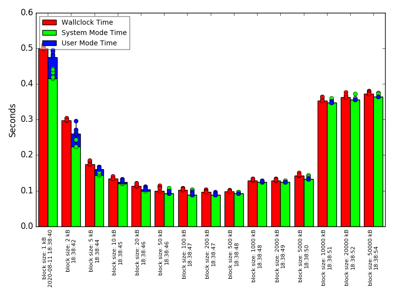

# shell-timeit

`timeit` runs a shell command multiple times, measures the execution time of each run, and prints the min/max/average times.
It can also collect results in a file and create a diagram of all collected results.

Shell Timeit was inspired by the Python Timeit module.

## Example ##
Run `dd` for in-memory copying with different block sizes:
* each size is tested five times (`-r 5`) instead of the default of three times
* the command is executed as shell command to allow redirecting output to `/dev/null` (`-s`)
* results are written to dd.json (`-f dd.json`)
* a comment is added for every test (`-m ...`)
* results are afterwards turned into a diagram (`-o dd.png`)

```shell
for s in 1 2 5 10 20 50 100 200 500 1000 2000 5000 10000 20000 50000; do
    echo "testing with bs="$s"kB"
    timeit -r 5 -s -f dd.json -m "block size: $s kB" "dd if=/dev/zero of=/dev/null bs=$s"kB" count=$((1000000/$s)) >/dev/null 2>&1"
done
timeit -f dd.json -o dd.png
```

Result:



The bars show the lowest execution time; the small dots are the results of each single run.

The diagram displays lowest time prominently because this is the fastest time that was achievable with the specified settings; the higher values just indicate that something interfered with the run.

By default the diagram shows "wallclock seconds", ie. elapsed time, and also system and user CPU time.
Other types of measurement can be displayed by specifying the measurement name before the diagram output file name, separated by "=".
Multiple measurements can be displayed in a single diagram by listing their names separated by ",".
Measurement values can be stacked by separating their names with "+".

Hence, the default diagram style can also be achieved like this:  
`timeit -f dd.json -o wallclock,ru_utime+ru_stime=dd.png`

For a list of available measurement names, refer to the [documentation of Python `resource` module](https://docs.python.org/2/library/resource.html#resource-usage) or the `getrusage(2)` man page.

## Alternative Tools
* [Bench](https://github.com/Gabriel439/bench)
* [hyperfine](https://github.com/sharkdp/hyperfine)

Similar to git-timeit:
* [chronologer](https://github.com/dandavison/chronologer)
